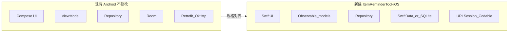

# 在新建文件夹中新增 iOS 端（零改动 Android）

## 约束与结论

- **不修改原有 Android 代码**：`[settings.gradle.kts](h:\AndroidAPP\Itemremindertool\settings.gradle.kts)`、`[app/build.gradle.kts](h:\AndroidAPP\Itemremindertool\app\build.gradle.kts)` 及 `app/src` 下文件均保持不动；不引入 Kotlin Multiplatform（KMM 会改 Gradle 与工程结构）。
- **“最少改动”在 Android 侧的含义**：仅当你们希望仓库层面忽略 Xcode 用户数据时，可考虑在根目录 `[.gitignore](h:\AndroidAPP\Itemremindertool\.gitignore)` **追加** `*.xcuserstate`、`xcuserdata/` 等一行或多行（可选，且与业务代码无关）。
- **实现方式**：在仓库根目录新建文件夹（建议名 `**ItemReminderTool-iOS/`**），内含完整 **Xcode 工程**（SwiftUI），以 Android 源码为**规格书**做平行实现，使**导航结构、分层（Repository / ViewModel 等价物）、界面布局与业务规则**与现有应用一致。

当前 Android 应用规模：约 **160+** 个 Kotlin 文件、Jetpack Compose + Material3、Room **v22**、`[NavGraph.kt](h:\AndroidAPP\Itemremindertool\app\src\main\java\com\example\itemremindertool\navigation\NavGraph.kt)` 中定义的 **主导航 + 大量子路由**（见 `Screen` 密封类），以及相机/条码、TensorFlow Lite、Retrofit 同步、WebDAV、内购、广告等。

---

## 推荐技术选型（与现有架构对齐）

| Android                                                                                                                                          | iOS 侧建议                                                                                                                                                                                                                                                                                                                     |
| ------------------------------------------------------------------------------------------------------------------------------------------------ | --------------------------------------------------------------------------------------------------------------------------------------------------------------------------------------------------------------------------------------------------------------------------------------------------------------------------- |
| `Navigation` + `Screen` 路由                                                                                                                       | `NavigationStack` + `enum`/路由字符串，与 `[NavGraph.kt](h:\AndroidAPP\Itemremindertool\app\src\main\java\com\example\itemremindertool\navigation\NavGraph.kt)` 路由名一致，便于对照与测试                                                                                                                                                      |
| `ViewModel` + `StateFlow`                                                                                                                        | `@Observable` / `ObservableObject` + `@MainActor`，异步用 `async/await`                                                                                                                                                                                                                                                         |
| Material3 主题                                                                                                                                     | 从 `[ui/theme/Color.kt](h:\AndroidAPP\Itemremindertool\app\src\main\java\com\example\itemremindertool\ui\theme\Color.kt)`、`[Theme.kt](h:\AndroidAPP\Itemremindertool\app\src\main\java\com\example\itemremindertool\ui\theme\Theme.kt)` 提取色板与排版，在 iOS 用 `Color`/`Font` 与 **语义化 token**（primary、surface 等）复刻，保证亮/暗与自定义色方案行为一致 |
| Room + DAO                                                                                                                                       | **SwiftData**（iOS 17+）或 **GRDB/SQLite**；实体字段与 `[AppDatabase.kt](h:\AndroidAPP\Itemremindertool\app\src\main\java\com\example\itemremindertool\data\database\AppDatabase.kt)` 及 `data/model` 对齐；迁移策略可参考 `app/schemas` 下导出的 JSON（逻辑迁移，不要求与 Android 共用同一物理 DB 文件，除非你们明确要做跨平台直接拷贝 DB）                                           |
| Retrofit + Gson DTO                                                                                                                              | `URLSession` + `Codable`；DTO 与 `[network/dto](h:\AndroidAPP\Itemremindertool\app\src\main\java\com\example\itemremindertool\network\dto)` 字段一致                                                                                                                                                                              |
| `WorkManager`                                                                                                                                    | `BGTaskScheduler` + `UNUserNotificationCenter`（提醒调度对齐 `[NotificationScheduler](h:\AndroidAPP\Itemremindertool\app\src\main\java\com\example\itemremindertool\notification)` 等行为）                                                                                                                                            |
| CameraX + ML Kit 条码                                                                                                                              | `AVFoundation` + **Vision**（条码）                                                                                                                                                                                                                                                                                             |
| TensorFlow Lite（`[FeatureExtractor.kt](h:\AndroidAPP\Itemremindertool\app\src\main\java\com\example\itemremindertool\ml\FeatureExtractor.kt)` 等） | [TensorFlow Lite Swift](https://www.tensorflow.org/lite/guide/ios) 或 Core ML（若后续转换模型）；输入输出与张量形状需与 Android 一致                                                                                                                                                                                                                |
| OkHttp WebDAV（云存储）                                                                                                                               | `URLSession` 自定义请求，语义对齐现有 WebDAV 工具类                                                                                                                                                                                                                                                                                        |
| `AppAuth`                                                                                                                                        | [AppAuth-iOS](https://github.com/openid/AppAuth-iOS)（SPM）                                                                                                                                                                                                                                                                   |
| Play Billing                                                                                                                                     | **StoreKit 2**                                                                                                                                                                                                                                                                                                              |
| AdMob                                                                                                                                            | Google Mobile Ads **iOS SDK**                                                                                                                                                                                                                                                                                               |
| Excel（POI）                                                                                                                                       | 选用 iOS 兼容的 xlsx 读写的 Swift 库，**导入/导出列与 Android** `[ExcelImportExportUtils.kt](h:\AndroidAPP\Itemremindertool\app\src\main\java\com\example\itemremindertool\utils\ExcelImportExportUtils.kt)` 对齐                                                                                                                             |
| Biometric + `EncryptedSharedPreferences`                                                                                                         | `LocalAuthentication` + Keychain                                                                                                                                                                                                                                                                                            |

依赖管理建议：**Swift Package Manager** 为主，少数 SDK（广告等）用 **XCFramework / CocoaPods** 若 SPM 不可用再评估。

---

## iOS 工程目录结构（建议与 Android 包名对应）

在 `ItemReminderTool-iOS/` 下按功能分包，便于与 `com.example.itemremindertool` 下目录一一对照：

- `App/`：`ItemReminderToolApp.swift`、根 `ContentView`、依赖注入入口
- `Navigation/`：路由枚举、`NavigationStack` 装配（对应 `Screen` + `MainActivity` 中 `NavHost`）
- `UI/Screens/`：每个 `*Screen.kt` 对应一个 `*View.swift`
- `UI/Components/`：对应 `ui/components`
- `Features/ViewModels/`：对应 `ui/viewmodel`
- `Data/Models/`、`Data/Repositories/`、`Data/Persistence/`：对应 `data/model`、`data/repository`、`data/database`
- `Network/`：对应 `network/ApiService.kt`、`RetrofitClient.kt`、`dto`
- `Platform/`：通知、后台任务、钥匙串、相机、ML 封装

---

## 分阶段交付（完整 1:1，但按风险拆分）

即使目标为完整对等，仍建议按依赖顺序合入，避免一次性巨型 PR：

1. **工程与壳**：Xcode 工程、多语言 `Localizable.strings`（对照 `[values*/strings.xml](h:\AndroidAPP\Itemremindertool\app\src\main\res\values\strings.xml)`）、主题与底部/侧栏导航与 `[Screen](h:\AndroidAPP\Itemremindertool\app\src\main\java\com\example\itemremindertool\navigation\NavGraph.kt)` 一致。
2. **本地数据与核心 CRUD**：物品、仓库、分类、标签、购物清单等与 Room 实体一致；主列表与详情编辑流程对齐 `[ItemsScreen](h:\AndroidAPP\Itemremindertool\app\src\main\java\com\example\itemremindertool\ui\screens\ItemsScreen.kt)`、`[ItemEditScreen](h:\AndroidAPP\Itemremindertool\app\src\main\java\com\example\itemremindertool\ui\screens\ItemEditScreen.kt)`、`[WarehouseDetailScreen](h:\AndroidAPP\Itemremindertool\app\src\main\java\com\example\itemremindertool\ui\screens\WarehouseDetailScreen.kt)` 等。
3. **提醒与通知**：本地通知与业务规则对齐 `ItemReminder` 与相关 ViewModel。
4. **网络与同步**：Retrofit API、`[SyncManager](h:\AndroidAPP\Itemremindertool\app\src\main\java\com\example\itemremindertool\sync\SyncManager.kt)`、队列与冲突策略。
5. **设备能力**：扫码、拍照/相册、图片裁剪、图标库；再 TFLite 图像特征。
6. **账户与云**：OAuth、WebDAV/云存储设置。
7. **商业化**：StoreKit、AdMob；权限与审核配置（Info.plist 用途说明）。
8. **Excel 备份/恢复**：与 Android 文件格式互操作测试。

每阶段用**同一套 UI 截图/Compose Preview 对照**（人工或快照测试）保证布局与交互一致。

---

## 风险与说明

- **工作量**：与“重写一套同等复杂度的原生 iOS 应用”相当；完整 1:1 需要持续迭代与真机测试（相机、推送、内购沙盒）。
- **布局像素级一致**：Compose 与 SwiftUI 布局模型不同，目标是**结构、间距层级、组件语义**一致；具体 dp/pt 可在设计 token 层统一。
- **若未来希望共享业务逻辑**：再单独评估 **KMM 新模块**（会动 Android Gradle，与本次“零改动”目标冲突）。

---

## 实施时第一步（确认计划后执行）

1. 在 `H:\AndroidAPP\Itemremindertool\ItemReminderTool-iOS\` 创建 Xcode 工程（iOS 17+ 若选 SwiftData）。
2. 建立 `Navigation` + 空 `View` 占位，路由表复制 `Screen` 定义。
3. 从 `Color.kt` / `Theme.kt` 抽出颜色与字体 scale，实现 `AppTheme`。
4. 按 `data/model` 建立 Swift 模型与持久化层骨架，再逐个屏幕从 `MainActivity`/`NavHost` 顺序移植。

