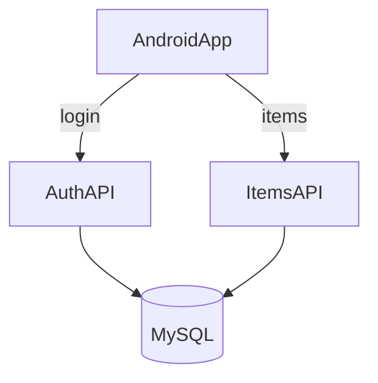

# Node 服务端与客户端对接方案

## 目标范围

- 服务端：Express + MySQL（JWT 登录/注册、物品/容器/分类/提醒/购物清单/动态/删除记录接口）。
- 客户端：新增网络层与认证存储，将物品管理读写对接到服务端（本地与远端策略明确）。

## 服务端设计

- **项目结构**：新增 `server/` 目录（Node.js + Express）。
- **数据库与 ORM**：使用 Prisma（MySQL），统一迁移与模型维护。
- **认证**：JWT（短期 access token + 可选 refresh），所有数据表带 `user_id`。
- **模型映射（与本地一致）**：
  - `Item`（含 `tags`：建议用 JSON 字段保存数组）
  - `Category` / `Warehouse` / `ShoppingItem` / `ItemReminder` / `ActivityEvent` / `DeletedRecord`
  - `User`（账号、显示名、密码哈希）
- **REST 接口**：
  - `POST /auth/register`、`POST /auth/login`、`POST /auth/refresh`、`POST /auth/logout`
  - `GET/POST/PUT/DELETE /items`
  - `GET/POST/PUT/DELETE /categories`
  - `GET/POST/PUT/DELETE /warehouses`
  - `GET/POST/PUT/DELETE /shopping-items`
  - `GET/POST/PUT/DELETE /reminders`
  - `GET /activity-events`（分页）
  - `GET /deleted-records`（用于同步）
- **数据处理**：分页、排序、过滤（按容器、分类、搜索名称、更新时间）。
- **安全与校验**：输入校验（zod）、统一错误响应、中间件鉴权、速率限制（可选）。

## 客户端对接（Android）

- **网络层**：新增 Retrofit + OkHttp（含 JWT 拦截器）。
- **配置**：在应用设置中加入服务器地址与登录入口，token 存储到 `SharedPreferences`。
- **数据策略**（一期）：登录后走服务端读写；未登录保持本地逻辑不变。
- **对接点**：以 `ItemRepository` 及相关 ViewModel 为入口，增加远端数据源。

## 关键文件

- 服务端（新建）：
  - `server/src/index.ts`
  - `server/src/routes/*`
  - `server/src/controllers/*`
  - `server/prisma/schema.prisma`
  - `server/src/middleware/auth.ts`
- 客户端（新增/修改）：
  - [`app/src/main/java/.../network/*`](h:\AndroidAPP\Itemremindertool\app\src\main\java\com\example\itemremindertool\network)
  - [`app/src/main/java/.../data/repository/ItemRepository.kt`](h:\AndroidAPP\Itemremindertool\app\src\main\java\com\example\itemremindertool\data\repository\ItemRepository.kt)
  - [`app/src/main/java/.../MainActivity.kt`](h:\AndroidAPP\Itemremindertool\app\src\main\java\com\example\itemremindertool\MainActivity.kt)（账号区域接入真实登录逻辑）

## 数据流示意

## 风险与处理

- 由于本地已有大量功能，需明确“登录后仅远端/本地+远端双写”的策略。一期先远端优先，减少冲突。
- `tags` 建议 MySQL JSON 保存，便于快速落地；后续如需高效查询再拆表。